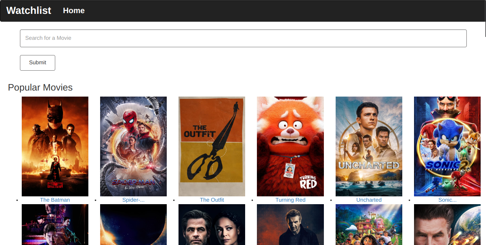
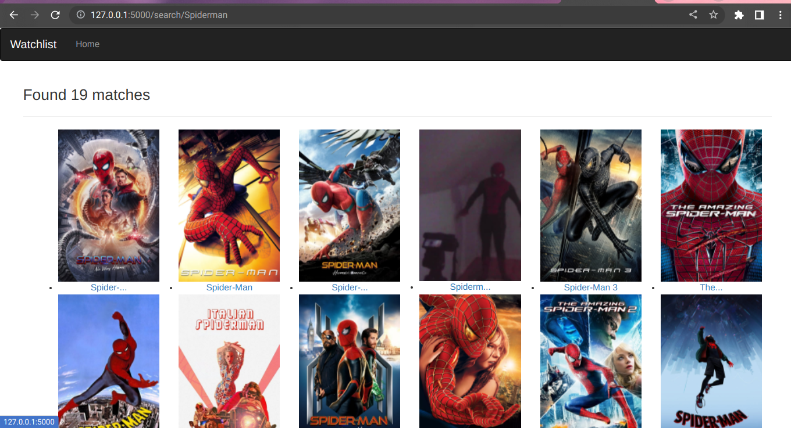

# PWDmanager
### Homepage

### Results After Certain Search


## Short Description
It is a python application that allow users to see a list of available movies as well as search for a particular movie. 


## Author
Nazarena Wambura.</br>
[Github](https://github.com/nazarena254)


## Technologies used
* Python
* Flask
* Markdown


## Behaviour Driven Development / BDD
* Given the user Follows the Procedure in the terminal after running the run.py file.
* When user enters su to sign up and creates username and password or li to login with username and password.
* Then the user can create credential account and add account name, username and password.<br>  Consequently, he/she can enter dc to diplay , sc to search, del to delete credential account, and finally ex to exit.<br>
Moreover, to create password for the credential accounts, the user has an option to create one manually or get it generated by the application.


## Installed packages
* Install code editor of your choice.
* Run `sudo apt-get update`,`sudo apt-get install python3.6` in terminal to install python.
* Install python extension in code editor(VScode) to run python modules easily.
* Run `python3.9 -m venv --without-pip virtual` in terminal to install virtual environment, python version varies.
* Run `source virtual/bin/activate` in terminal to activate and `.../deactivate` to deactivate the virtual environment, python version varies.
* Run `pip install flask` in terminal to install flask, you should activate the virtual environment before installing the flask.
* Run `pip install flask` in terminal to install flask, you should activate the virtual environment before installing the flask.
* Run `pip install flask-bootstrap` in terminal to install flask-bootstrap, you should activate the virtual environment before installing the flask.
* Run `pip install flask-wtf` in terminal to install WTF forms, you should activate the virtual environment before installing the flask.


## Installation / Setup instruction
* Open Terminal {Ctrl+Alt+T}
* create and cd to the directory where you want to have your project
* git clone ```https://github.com/nazarena254/movieApi.github.io.git``` to have it on your machine.
* code . or atom . based on the text editor you have.
* work on it.